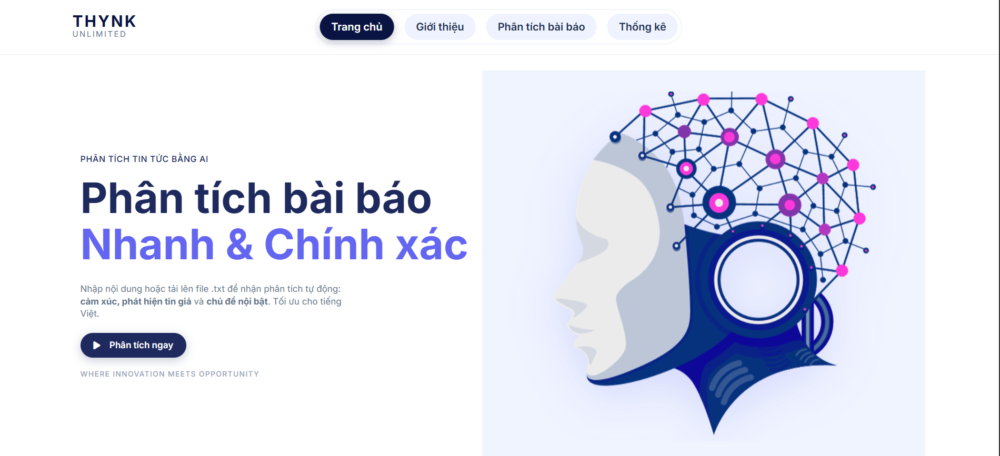
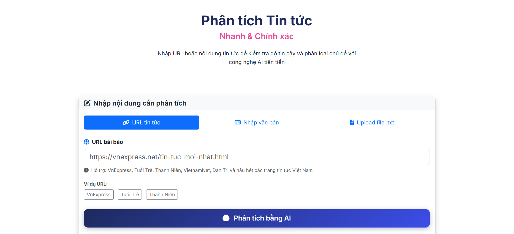

# 📰 Web News Analytics System

## 📌 Giới thiệu
**Web News Analytics** là hệ thống thu thập, xử lý và phân tích tin tức trực tuyến bằng các kỹ thuật **Xử lý ngôn ngữ tự nhiên (NLP)** và **Machine Learning**.  
Dự án hỗ trợ trích xuất nội dung, phân loại chủ đề, phân tích xu hướng và trực quan hóa dữ liệu tin tức.

---

## 🎯 Mục tiêu dự án
- Thu thập tin tức từ nhiều nguồn web
- Làm sạch và tiền xử lý văn bản tiếng Việt
- Phân tích nội dung và chủ đề tin tức
- Hỗ trợ nghiên cứu, học tập và phân tích dữ liệu báo chí

---

## 🧠 Chức năng chính
- 🕷️ Crawl dữ liệu tin tức từ website
- ✂️ Tiền xử lý văn bản (tokenize, loại bỏ stopwords, chuẩn hóa)
- 🏷️ Phân loại / gom cụm chủ đề tin tức
- 📊 Phân tích và thống kê dữ liệu
- 📈 Trực quan hóa kết quả phân tích

---

## 🖥️ Giao diện hệ thống

### 🔹 Trang chính
 

### 🔹 Trang phân tích tin tức


---

## 🛠️ Công nghệ sử dụng

### Backend / Data Processing
- **Python**
- **Transformers (HuggingFace)**
- **PyTorch**
- **scikit-learn**
- **BERTopic**
- **UMAP**
- **HDBSCAN**

### NLP & Tiếng Việt
- **underthesea**
- **sentencepiece**

### Data & Utilities
- **pandas**
- **tqdm**

---

## 📂 Cấu trúc thư mục
```text
WebNewsAnalytics/
│
├── data/                 # Dữ liệu thô và dữ liệu đã xử lý
├── models/               # Mô hình Machine Learning
├── notebooks/            # Notebook thử nghiệm và phân tích
├── src/                  # Source code chính
│   ├── crawl/            # Thu thập dữ liệu
│   ├── preprocess/       # Tiền xử lý văn bản
│   ├── modeling/         # Huấn luyện & phân tích mô hình
│   └── visualization/   # Trực quan hóa dữ liệu
│
├── requirements.txt
└── README.md


## 📂 Model đã train
Do giới hạn dung lượng GitHub, model không được lưu trực tiếp trong repo.

👉 Tải model tại đây: [Google Drive](https://drive.google.com/drive/folders/1ZjtNFmcrmdDSA4aOVbVq9BJMRSBcEkGt?usp=sharing)

Sau khi tải về, đặt vào thư mục `best_model/` để chạy tiếp.

- Mona Ha: Phần tải dữ liệu, mô hình và hướng dẫn sử dụng Google Drive
  tải model tại đây: https://drive.google.com/drive/folders/1eoJNBTybc1lLnhSYWdoKQHL7-8BCOLY2?usp=sharing
